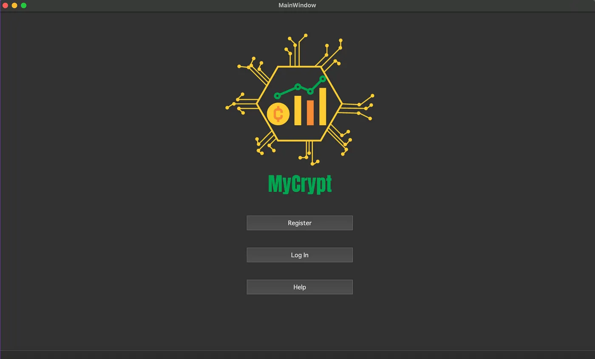

# MY Cryptic


## Description
MY Cryptic is a C++ application that simulates a stock trading system. It enables multiple traders to buy and sell stocks in a real-time environment. The system maintains an order book and matches buy/sell orders efficiently, even in a multi-threaded setting. The application is built using the Qt framework, providing a robust and user-friendly interface.
https://medium.com/@artur.araqelyan.0001/mycrypt-transforming-stock-trading-a-deep-dive-into-a-c-and-qt-powered-multi-threaded-system-278ac70afb26

## Features
- Real-time stock trading simulation
- Multi-trader support
- Order book maintenance
- Multi-threaded order matching
- User-friendly interface built with Qt

## Installation and Setup

### Prerequisites
- C++ compiler (GCC, Clang, MSVC, etc.)
- Qt SDK
- SQLite (or another database system if you prefer, but you'll need to modify the code accordingly)

### Steps to Install Qt SDK
1. Download the Qt installer from the official [Qt website](https://www.qt.io/download).
2. Follow the installation instructions provided in the installer.

### Configuring the Database
MY Cryptic uses SQLite for database operations. You need to ensure that the database file path in `main.cpp` is correctly set up:

1. Locate the following line in `main.cpp`:

   ```cpp
   db.setDatabaseName("/Users/artur/Desktop/Nor 2/user.sqlite");
   
Change the path to the correct location on your system where you want the SQLite database file to be stored.

For example:
 ```cpp
   db.setDatabaseName("/path/to/your/directory/user.sqlite");
```
2.Save the changes.

### Building the Application
1. Clone the repository:
   ```sh
   git clone <https://github.com/ArturArakelyan1/MyCrypt-Trading-System>
   cd <https://github.com/ArturArakelyan1/MyCrypt-Trading-System>

  2. Open the .pro file with Qt Creator.
  3. Configure the project with the appropriate Qt Kit.
  4. Build and run the application.
<p>&nbsp</p>

<h3 align="left">Connect with me:</h3>
<p align="left">
<a href="https://www.linkedin.com/in/artur-arakelyan-9a4355278/" target="blank"></a>
<a href="https://medium.com/@artur.araqelyan.0001" target="blank"></a>
</p>
<p></p>
